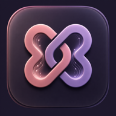
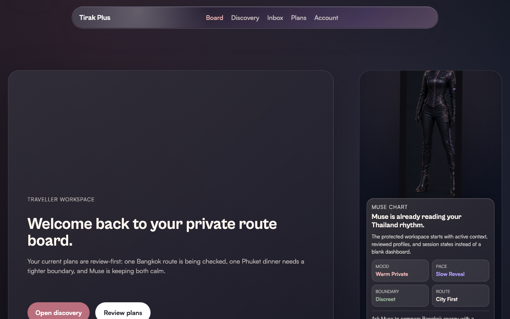
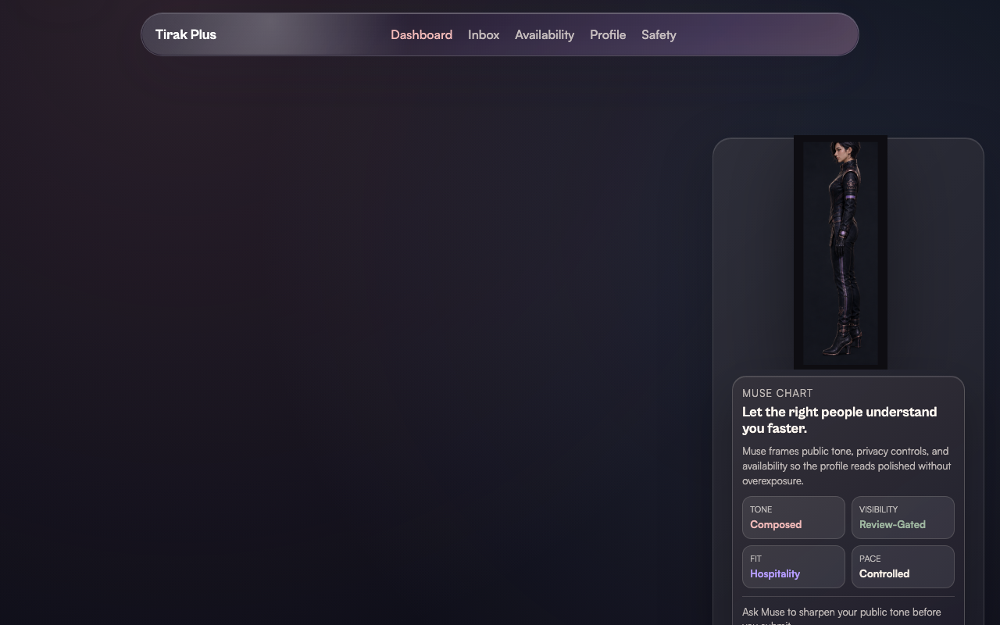
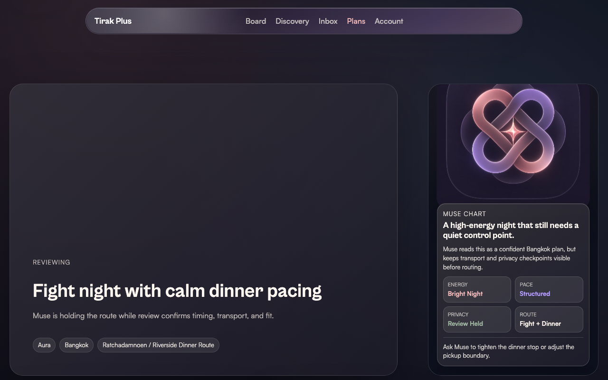
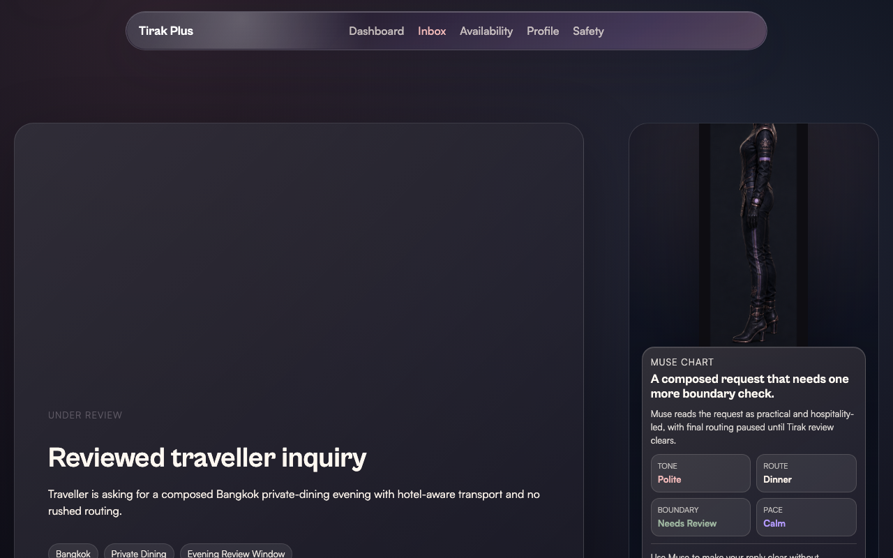
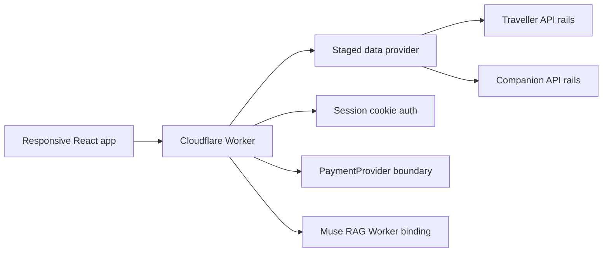

# Tirak Plus

<div align="center">



**Muse-led private Thailand discovery for travellers and companions.**


</div>

Tirak Plus is a premium responsive web app for discreet Thailand introductions. The product opens through **Muse**, a conversational guide that gathers context, shapes traveller intent, supports companion onboarding, and routes users into protected traveller or companion workspaces without swipe-first or pressure-driven patterns.

The current repo contains the customer app, staged Cloudflare Worker APIs, Muse RAG Worker setup, design system, generated visual assets, protected demo data, and evidence screenshots for the completed public and logged-in waves.

## Product Shape

- **Muse-first entry**: the public root is a chat-led experience, not a generic dashboard.
- **Traveller workspace**: protected dashboard, discovery, companion profiles, private inquiries, plans, sessions, and account QA rails.
- **Companion workspace**: protected dashboard, onboarding, profile manager, availability controls, routed inquiry decisions, safety, and account rails.
- **Review-first states**: profile visibility, routing, payments, and introductions stay gated by review and compliance state.
- **Dark premium UI**: protected flows use dark glass/bento surfaces, Muse character assets, and responsive web layouts.
- **API-shaped staging**: demo data is served through Worker routes so production data stores can replace staged providers without rewriting components.

## Screens

| Traveller | Companion |
| --- | --- |
|  |  |
|  |  |

More QA screenshots are in [`specs/001-tirakplus-customer-app/evidence/screenshots/`](specs/001-tirakplus-customer-app/evidence/screenshots/).

## Visual Assets

The active app uses checked-in Tirak and Muse assets:

- Brand icons: [`public/assets/brand/`](public/assets/brand/)
- Muse character poses and scene layers: [`public/assets/muse/`](public/assets/muse/)
- Staged companion portraits: [`public/assets/profiles/`](public/assets/profiles/)
- Generated reference material: [`generated/`](generated/)

These assets are treated as product references, not decorative filler. Muse can appear as a PNG character in the UI while 3D/model work remains optional for later phases.

## Architecture



Core files:

- [`src/app/main.tsx`](src/app/main.tsx): route map for public, traveller, and companion surfaces.
- [`src/shared/contracts.ts`](src/shared/contracts.ts): shared API contracts.
- [`src/worker/index.ts`](src/worker/index.ts): Worker API router.
- [`src/worker/staged-data.ts`](src/worker/staged-data.ts): staged API-backed demo state.
- [`src/worker/route-registry.ts`](src/worker/route-registry.ts): machine-readable route registry.
- [`workers/muse-rag/`](workers/muse-rag/): separate Muse RAG Worker scaffold.

## Quick Start

```bash
npm install
npm run check
npm run dev
```

The local Worker runs at:

```text
http://127.0.0.1:8787
```

Useful scripts:

| Command | Purpose |
| --- | --- |
| `npm run build` | Build the React app with Vite. |
| `npm run cf:types` | Generate Cloudflare Worker types. |
| `npm run check` | Generate Worker types, typecheck, and build. |
| `npm run contract:smoke` | Probe public, auth, traveller, companion, payment, and safety API contracts. |
| `npm run dev` | Build and run Wrangler locally on port `8787`. |

## Environment

The customer Worker is configured through [`wrangler.jsonc`](wrangler.jsonc). Current staged bindings include:

- `MUSE_AGENT_CONFIG`
- `MUSE_RAG`
- `MUSE_AGENT_MODE`
- `MUSE_AGENT_CONFIG_KEY`
- `PAYMENT_PROVIDER_MODE`

Secret values are managed through Wrangler and must not be committed. Payment creation remains disabled behind the compliance gate until provider supportability is approved for the exact business model and jurisdiction.

## Source Of Truth

- [`DESIGN.md`](DESIGN.md): binding product and visual rules.
- [`.specify/memory/constitution.md`](.specify/memory/constitution.md): implementation constitution.
- [`docs/design/`](docs/design/): responsive matrix, component system, asset usage, and visual QA.
- [`docs/architecture/`](docs/architecture/): Cloudflare boundaries, route registry, data model, and Muse setup.
- [`docs/payments/`](docs/payments/): Stripe decision and provider alternatives.
- [`docs/issues/backlog-map.md`](docs/issues/backlog-map.md): local issue source map.
- [`tasks/todo.md`](tasks/todo.md): execution history and validation notes.

## Validation

Latest logged-in wave validation:

- `npm run check` passed.
- `npm run contract:smoke` passed with 30 checks.
- Chrome/CDP logged-in smoke captured 16 protected route screenshots.
- GitHub issues `#155` through `#179` were closed after evidence comments.
- Current open issue count is `0`.

## About

Read the product and positioning summary in [`docs/about-us.md`](docs/about-us.md).
